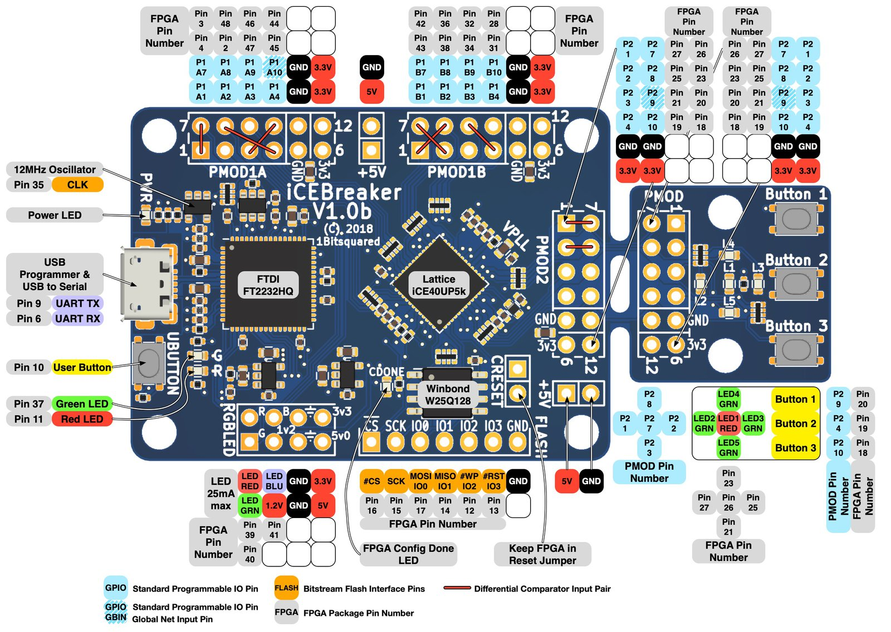

# openOCD and GDB bringup

- [openOCD and GDB bringup](#openocd-and-gdb-bringup)
  * [Prerequisites](#prerequisites)
    + [Software](#software)
    + [Hardware](#hardware)
  * [Bitstream generation](#bitstream-generation)
  * [Hardware wiring](#hardware-wiring)
  * [openOCD](#openocd)
  * [GDB](#gdb)


## Prerequisites

### Software

Make sure that you have `yosys` and `nextpnr-ice40` installed, as stated in [Quick Start tutorial](./run.md). `riscv-none-embed-gcc` or `riscv-none-elf-gcc` compiler is also required in your PATH, in order to compile default ELF to be running on board power-up.


### Hardware

* `iCEBreaker FPGA` devkit
* `Digilent JTAG HS3` - though you can use any - just make `-f` flag of `openOCD` invocation param to point to a config valid for your device.


## Bitstream generation


Compile the bitstream with default CPU config:
```bash
mateusz@koala:~/github/mtkcpu$ PROJ_NAME=uart_tx ; ./mtkcpu/cli/top.py build -e sw/$PROJ_NAME/build/$PROJ_NAME.elf 
```

Note that we used `uart_tx` project and not the `blink_led`, so the LEDs are not supposed to be blinking.

## Hardware wiring



All JTAG pins are connected to `PMOD1B`.

* TMS - `Pin 43`
* TDI - `Pin 38`
* TDO - `Pin 34`
* TCK - `Pin 31`
* GND - I connected it to the neighbor pin to `Pin 31`
* VCC - Neighbor pin to `GND` does not work for me, any other `3.3` does work fine.

If you see following error log when running `openOCD`:

```
Error: dtmcontrol is 0. Check JTAG connectivity/board power.
Warn : target riscv.cpu examination failed
Info : starting gdb server for riscv.cpu on 3333
Info : Listening on port 3333 for gdb connections
Error: dtmcontrol is 0. Check JTAG connectivity/board power.
Error: dtmcontrol is 0. Check JTAG connectivity/board power.
Error: dtmcontrol is 0. Check JTAG connectivity/board power.
```

please try connecting VCC to another 3.3V pin.


## openOCD

In one terminal session, run the `openocd`. The stable version is commit `53f21336c4794f94b47e3219a5ad7eec20fa3eab` (8 Sep 2023) from [Official RISC-V openOCD repository](https://github.com/riscv/riscv-openocd/commit/53f21336c4794f94b47e3219a5ad7eec20fa3eab).


```bash
../riscv-openocd/src/openocd -f board/digilent.openocd 
```

Expected output contains following:


```bash
Open On-Chip Debugger 0.12.0+dev-03036-g53f21336c-dirty (2023-09-11-00:09)
Licensed under GNU GPL v2
For bug reports, read
	http://openocd.org/doc/doxygen/bugs.html
DEPRECATED! use 'adapter driver' not 'interface'
DEPRECATED! use 'ftdi vid_pid' not 'ftdi_vid_pid'
DEPRECATED! use 'ftdi layout_init' not 'ftdi_layout_init'
DEPRECATED! use 'ftdi layout_signal' not 'ftdi_layout_signal'
DEPRECATED! use 'adapter speed' not 'adapter_khz'
Info : Listening on port 6666 for tcl connections
Info : Listening on port 4444 for telnet connections
Info : clock speed 100 kHz
Info : JTAG tap: riscv.cpu tap/device found: 0x10e31913 (mfg: 0x489 (SiFive Inc), part: 0x0e31, ver: 0x1)
Info : [riscv.cpu] datacount=2 progbufsize=3
Info : [riscv.cpu] Disabling abstract command reads from CSRs.
Info : [riscv.cpu] Disabling abstract command writes to CSRs.
Info : [riscv.cpu] Examined RISC-V core; found 1 harts
Info : [riscv.cpu]  XLEN=32, misa=0x40000100
[riscv.cpu] Target successfully examined.
Info : starting gdb server for riscv.cpu on 3333
Info : Listening on port 3333 for gdb connections
```

## GDB

```bash
riscv-none-embed-gdb -x board/breakpoint_example.gdb sw/blink_led/build/blink_led.elf
```

Expected output contains following:

```
Loading section .init, size 0x18 lma 0x80000000
Loading section .text, size 0x12c lma 0x80000018
Loading section .rodata, size 0x52 lma 0x80000144
Start address 0x80000000, load size 406
Transfer rate: 4 KB/sec, 135 bytes/write.
--Type <RET> for more, q to quit, c to continue without paging--
Breakpoint 1 at 0x80000020
warning: platform-specific solib_create_inferior_hook did not load initial shared libraries.

Breakpoint 1, 0x80000020 in main ()

(gdb) █
```


Try out following commands, at the same time looking at the LEDs state:

```
cont
cont
delete breakpoints
cont
Ctrl+C
si
```
